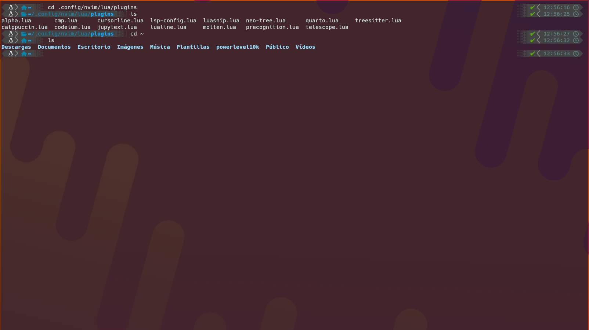
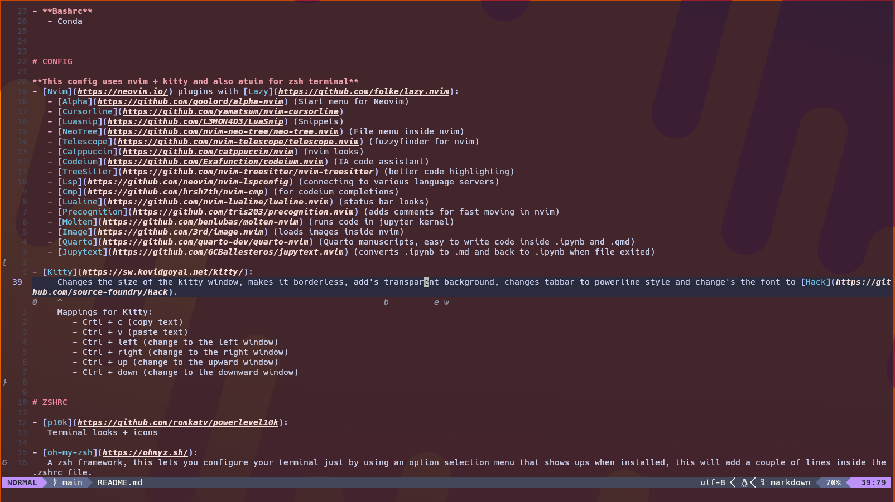
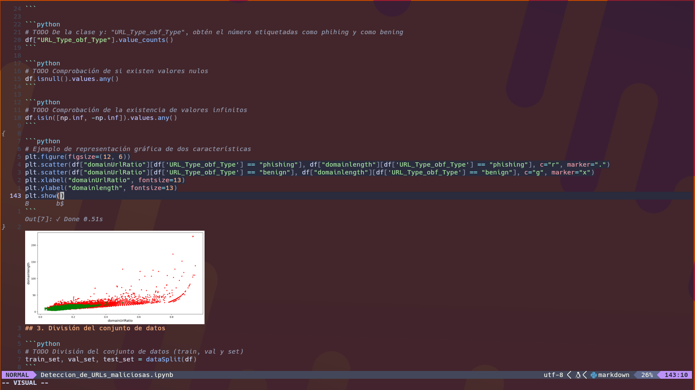

# DOTFILES FOR [FEDORA v40](https://fedoraproject.org/es/)

- **SetUp**
   - Stow
- **Config**
   - Nvim
   - Kitty
- **Zshrc**
   - p10k
   - oh-my-zsh
- **Bashrc**
   - Conda

# SETUP

If you want to use this dotfiles, you can do the following:
1. Install [Stow](https://www.gnu.org/software/stow/) (Stow is an easy way to manage dotfiles)
2. Create a symlink for every file with the following command:
    stow <file_name> (for example "stow nvim")
3. Check for the symlink in the home folder or in the .config folder

# CONFIG

**This config uses nvim + kitty and also atuin for zsh terminal**
- [Nvim](https://neovim.io/) plugins with [Lazy](https://github.com/folke/lazy.nvim):
   - [Alpha](https://github.com/goolord/alpha-nvim) (Start menu for Neovim)
   - [Cursorline](https://github.com/yamatsum/nvim-cursorline)
   - [Luasnip](https://github.com/L3MON4D3/LuaSnip) (Snippets)
   - [NeoTree](https://github.com/nvim-neo-tree/neo-tree.nvim) (File menu inside nvim)
   - [Telescope](https://github.com/nvim-telescope/telescope.nvim) (fuzzyfinder for nvim)
   - [Catppuccin](https://github.com/catppuccin/nvim) (nvim looks)
   - [Codeium](https://github.com/Exafunction/codeium.nvim) (IA code assistant)
   - [TreeSitter](https://github.com/nvim-treesitter/nvim-treesitter) (better code highlighting)
   - [Lsp](https://github.com/neovim/nvim-lspconfig) (connecting to various language servers)
   - [Cmp](https://github.com/hrsh7th/nvim-cmp) (for codeium completions)
   - [Lualine](https://github.com/nvim-lualine/lualine.nvim) (status bar looks)
   - [Precognition](https://github.com/tris203/precognition.nvim) (adds comments for fast moving in nvim)
   - [Molten](https://github.com/benlubas/molten-nvim) (runs code in jupyter kernel)
   - [Image](https://github.com/3rd/image.nvim) (loads images inside nvim)
   - [Quarto](https://github.com/quarto-dev/quarto-nvim) (Quarto manuscripts, easy to write code inside .ipynb and .qmd)
   - [Jupytext](https://github.com/GCBallesteros/jupytext.nvim) (converts .ipynb to .md and back to .ipynb when file exited)
    
    Photo of .ipynb file opened inside nvim
    

- [Kitty](https://sw.kovidgoyal.net/kitty/):
     Changes the size of the kitty window, makes it borderless, add's transparent background, changes tabbar to powerline style and change's the font to [Hack](https://github.com/source-foundry/Hack).
     Mappings for Kitty:
        - Crtl + c (copy text)
        - Ctrl + v (paste text)
        - Ctrl + left (change to the left window)
        - Ctrl + right (change to the right window)
        - Ctrl + up (change to the upward window)
        - Ctrl + down (change to the downward window)

# ZSHRC

- [p10k](https://github.com/romkatv/powerlevel10k):
   Terminal looks + icons
  
- [oh-my-zsh](https://ohmyz.sh/):
   A zsh framework, this lets you configure your terminal just by using an option selection menu that shows ups when installed, this will add a couple of lines inside the .zshrc file.
